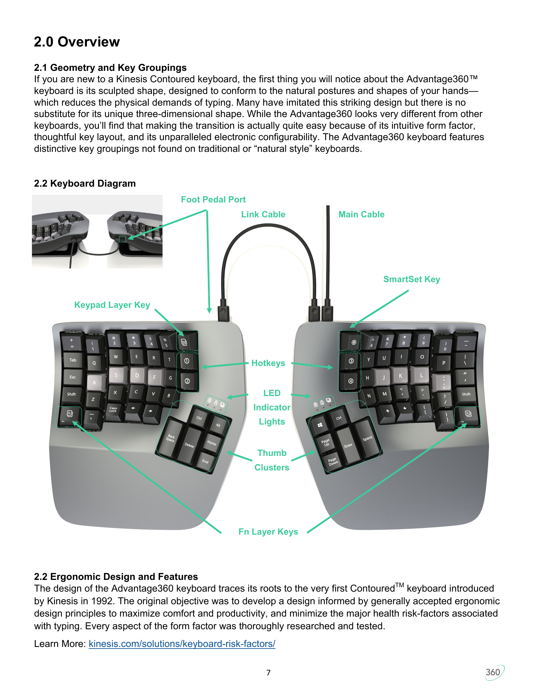
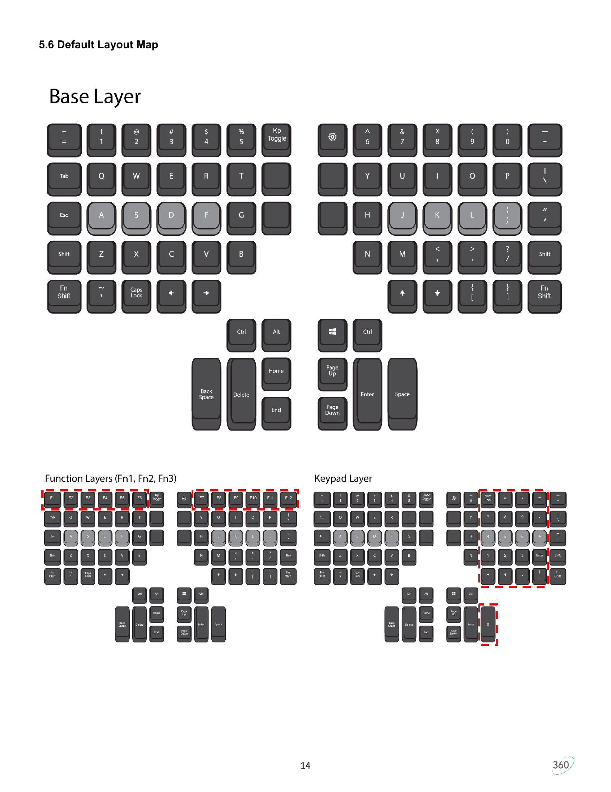

# Adv360 (Wired) Firmware: Check & Flash

Distilled from `Advantage360-SmartSet-Firmware-Update-Instructions.pdf` (Kinesis, 9/5/2024). Applies to the **wired** Adv360 (KB360, SmartSet engine), **not** the Pro (KB360-PRO).

## Keys you'll need

- **SmartSet** — the gear-shaped button on the **right module**, top-left corner, immediately to the left of the **6** key. (Per the manual: "Gear Icon, right module".)
- **v-Drive** — this is **Hotkey 3**, the third key down in the column of four Hotkeys directly below the SmartSet key on the right module. The Hotkeys are unlabeled on the keycap face but have small gear icons on the front edge.

See `keyboard-diagram.png` for a labeled photo of the physical layout (SmartSet, Hotkeys, Keypad Layer key, Fn Layer keys, thumb clusters). See `default-layout.png` for the per-key character map of the stock Base / Function / Keypad layers.





> **Important: SmartSet shortcuts use default-layer key positions.**
> All SmartSet shortcuts (Status Report, install firmware, etc.) read the
> **physical key positions of the default layer / Profile 1 stock layout** —
> they ignore your remaps. If you've remapped a key that appears in a SmartSet
> shortcut (e.g., `?`, `U`, `Right Ctrl`, `Right Shift`), you must press the
> key in the position where it lives on the **stock** layout, not where you
> mapped it. Easy way to think about it: SmartSet shortcuts are wired to
> physical scancodes on the default profile, so press the key as if no remaps
> existed.

## Check the current version

Press: **SmartSet + Right Shift + Right Ctrl + ?**

This runs an on-keyboard "Status Report" that types out the firmware version (and other info) wherever the cursor is focused. Open a text editor first.

If nothing happens: you've probably remapped one of the keys in the shortcut.
On the stock Adv360 US layout, `?` is **Shift + /** (the `/` key sits at the
bottom-right of the right-half main block). Press the `/` key in its
**stock-layout position**, even if you remapped it.

## Flash new firmware

Firmware file in this directory: `Adv360_1.0.79_update.upd` (already extracted from `Adv360_1.0.79_update.zip`).

1. **Open the v-Drive** on the keyboard:
   **SmartSet + v-Drive**. The indicator LEDs flash four times to confirm the press, then stay blue while the drive is open.
   A removable drive named `ADV360` mounts on your PC.
2. **Back up the v-Drive** (recommended — preserves layouts/macros if anything goes sideways):
   ```
   ./backup-vdrive.sh
   ```
   Creates a timestamped `vdrive-backup-YYYYMMDD-HHMMSS/` folder in this directory with a `SHA256SUMS` manifest.
3. **Copy** `Adv360_1.0.79_update.upd` into the `firmware/` subfolder on the `ADV360` drive.
   - If older `*update*.upd` files are already in `firmware/`, **delete or rename them first**. The installer picks the first matching file, so multiples will cause the wrong one to flash.
4. **Eject** the `ADV360` drive from your OS, then **close the v-Drive**:
   **SmartSet + v-Drive** (LEDs flash green 4x).
   - **Known quirk on firmware 1.0.69 (observed 2026-05-07):** after
     ejecting the drive and pressing **SmartSet + v-Drive**, the right
     half's LEDs may stay solid green, the left half's LEDs go dark, and
     **both halves become unresponsive to typing**. Reproduced twice in
     a row. Recovery: **unplug and replug the USB cable** — the keyboard
     comes back normally. After recovery you can skip reopening the
     v-Drive and go straight to step 5; the `.upd` file is already on
     the v-Drive's flash storage.
   - It is not yet known whether 1.0.79 still has this behavior.
5. **Install** the firmware:
   **SmartSet + Right Ctrl + U** (LEDs flash green 4x, then cycle blue on both halves).
   - Takes ~45 seconds.
   - **Do not unplug or type during install.** Cutting power mid-flash can brick a half.
   - **Both halves must be communicating before you start.** If the left half is currently dead, replug USB to recover it before flashing.
6. **Verify**: re-run the Status Report (**SmartSet + Right Shift + Right Ctrl + ?**) and confirm the version matches the `.upd` you flashed (1.0.79).

## If something goes wrong

- Mid-flash power loss: contact `tech@kinesis.com`. Don't try to recover it yourself.
- Status Report shows old version after flash: an older `.upd` was probably picked up. Delete every `.upd` in the v-Drive's `firmware/` folder, copy only the new one, and re-run step 5.
